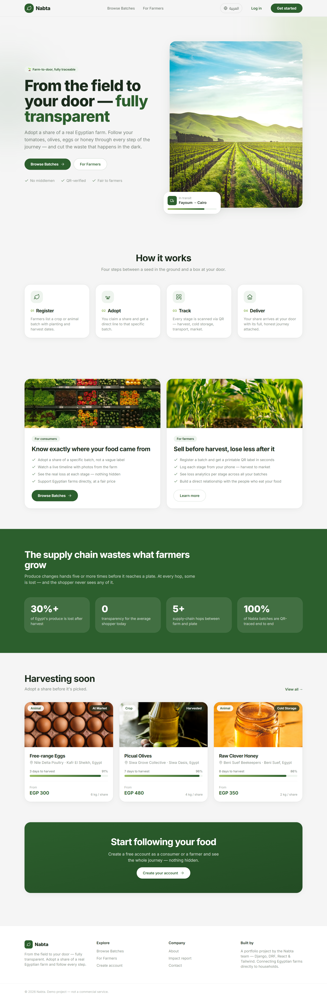
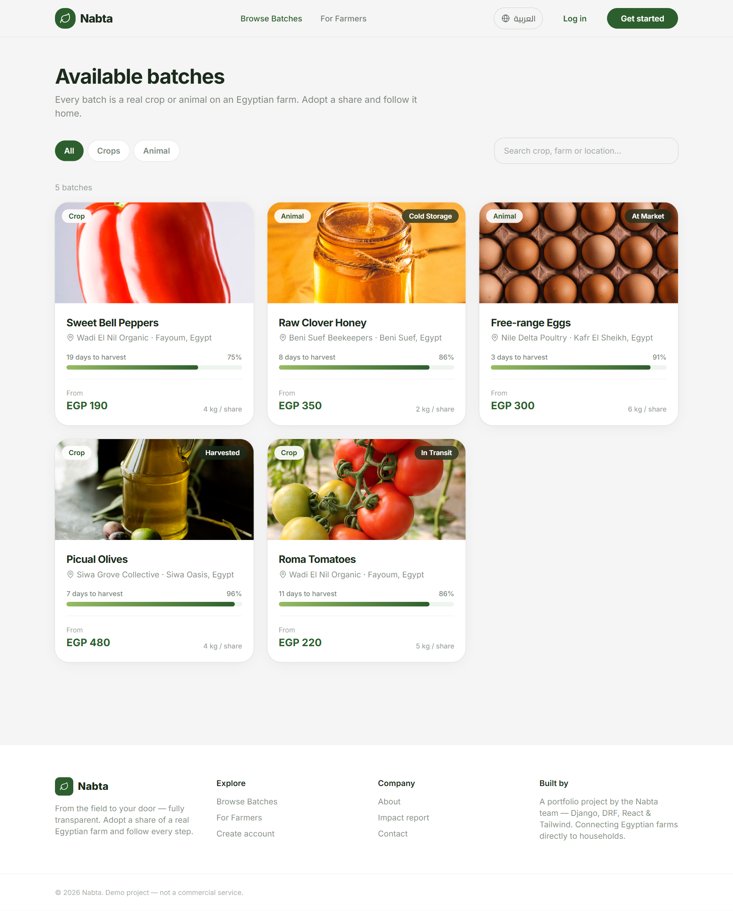
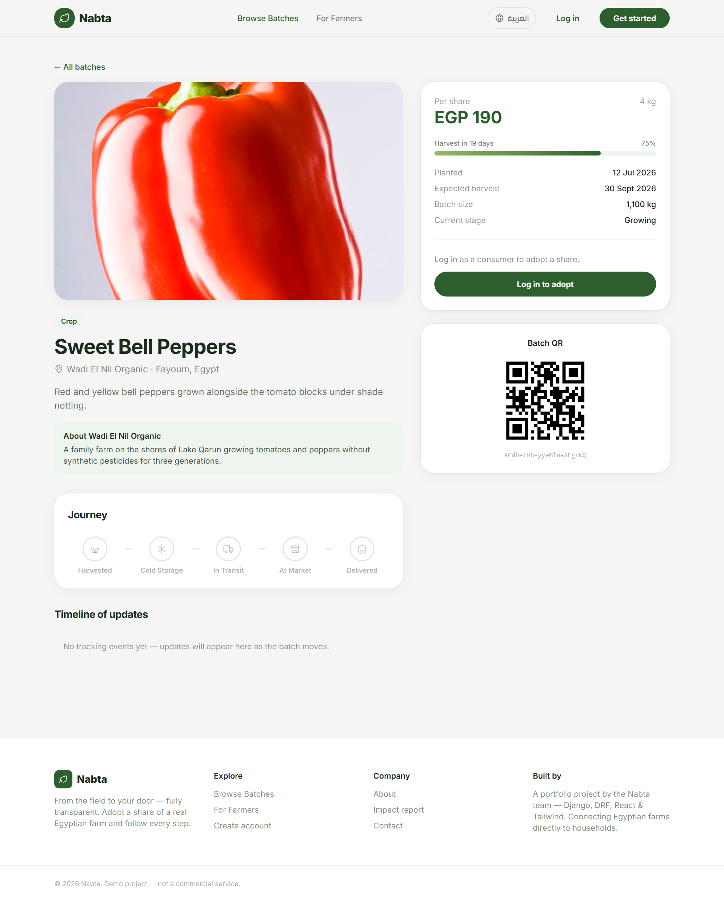
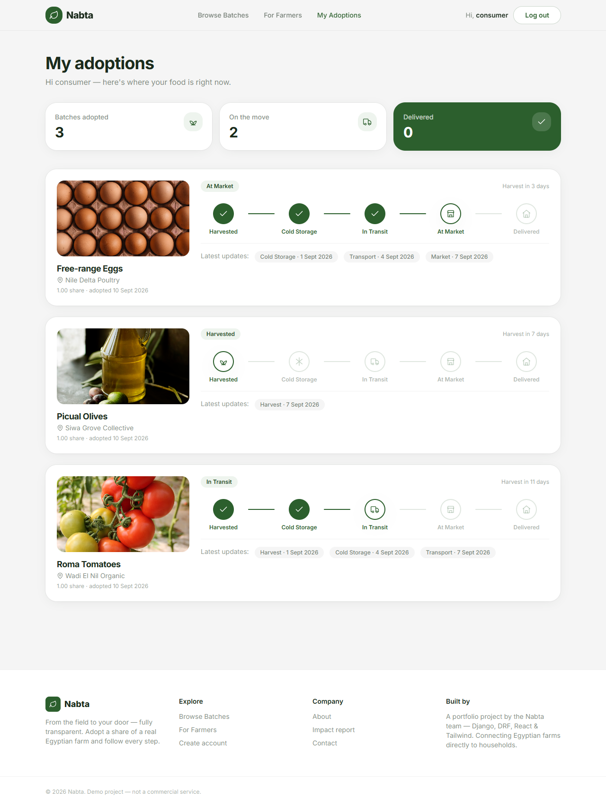
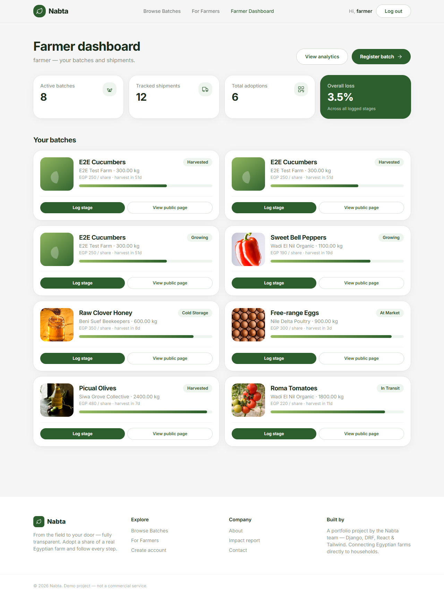
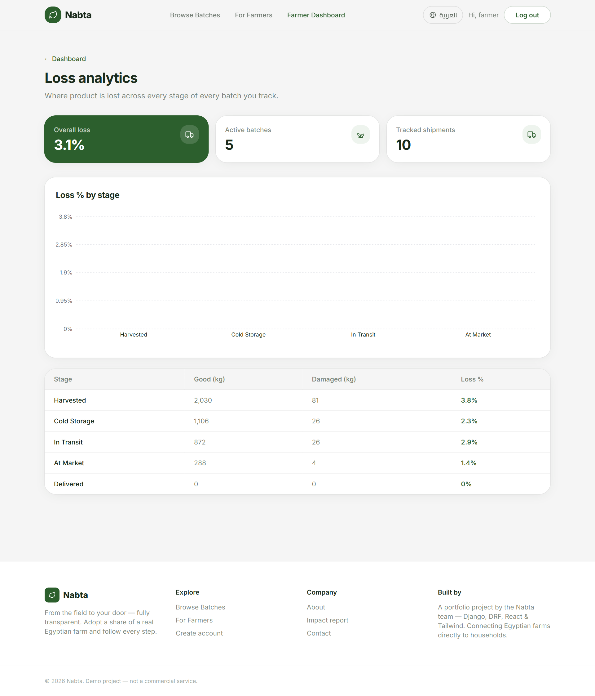

# Nabta 🌱

**From the field to your door — fully transparent.**

Nabta connects consumers directly to real farms through a subscription model, while tracking every shipment from harvest to market to eliminate post-harvest loss in Egypt's agricultural supply chain — turning invisible waste into transparent, trackable data, and turning food into a shared experience rather than just a product.

## The Problem

- **30%+** of crops are lost between harvest and market in Egypt due to poor storage, slow transport, and lack of coordination.
- **Zero real transparency** for consumers about where their food comes from or how it was grown.
- Small farmers have **no data** on exactly where loss happens in their supply chain — everything is guesswork.

## The Solution

Nabta is a two-sided platform:

- **For Consumers:** Adopt a share of a crop or animal, follow its journey with photos and updates until it actually reaches your door.
- **For Farmers:** Log every shipment with a QR code, and know exactly where loss happens across the supply chain.

The same tracking data that helps farmers reduce loss is what powers a transparent, trust-building experience for the consumer.

## How It Works

1. **Register Batch** — Farmer logs a crop batch and gets a unique QR code.
2. **Adopt** — Consumer subscribes to a share of that batch and follows its growth.
3. **Track** — Every transport stage (harvest → cold storage → transport → market) is logged against the same QR code, recording quantity delivered safely vs. damaged.
4. **Deliver** — Consumer receives their share and sees the full, transparent journey of their product — including the actual loss percentage at each stage.

## Business Model

| Stream | Description |
|---|---|
| Consumer Subscriptions | Monthly subscription to adopt a share of a crop or animal |
| SaaS Subscription for Farmers | Monthly fee for shipment tracking and analytics tools |
| Direct Sales, No Middleman | Farmers earn more per unit, consumers pay less than market price |

## Hackathon MVP Scope

- [ ] Register one crop batch with a unique QR code
- [ ] Consumer-facing page: adopt a batch + view updates
- [ ] 3 tracking points: harvest → transport → market
- [ ] Simple dashboard showing loss percentage per stage

## Tech Stack

- **Backend:** Django, Django REST Framework, PostgreSQL
- **Frontend:** React
- **Tracking:** QR code generation & scanning

## Data Model (Draft)

- `Batch` — id, crop_type, farm_name, planted_date, expected_harvest_date, qr_code
- `Farm` — name, location, photos
- `ConsumerSubscription` — user, batch, quantity_committed
- `TrackingEvent` — batch_id, stage (harvest / cold_storage / transport / market), quantity_ok, quantity_damaged, timestamp, location

## Team

- **Farha Mohamed Ghallab** — Full-Stack Python Developer
- **Manar Elsayed Mahmoud** — Full-Stack Python Developer

---

*Submitted for SmartX Hackathon 2026 — Industry Track*
# 🌱 Nabta

**From the field to your door — fully transparent.**

Nabta connects consumers directly to real farms in Egypt. Consumers *adopt* a
share of a crop or animal batch and follow its journey — harvest, cold storage,
transport, market, delivery — through QR-tracked supply-chain events. Farmers
register batches, print a QR label, and log each stage from their phone,
reducing post-harvest loss.

> Portfolio project. Django REST API + React (Vite) + Tailwind.

---

## Screenshots

| Landing | Browse batches | Batch detail |
| --- | --- | --- |
|  |  |  |

| My adoptions (consumer) | Farmer dashboard | Loss analytics |
| --- | --- | --- |
|  |  |  |

---

## Stack

| Layer     | Tech                                                            |
| --------- | -------------------------------------------------------------- |
| Backend   | Django 5.2, Django REST Framework, SimpleJWT, django-filter    |
| Database  | PostgreSQL (SQLite fallback for local dev)                     |
| Frontend  | React 19 (Vite), React Router, Tailwind CSS, Recharts, Axios   |
| QR codes  | `qrcode` (Python) for generation, `BarcodeDetector` for scanning |
| Deploy    | Vercel (frontend) · Render/Railway (backend + Postgres)        |

---

## Local development

### 1. Backend

```bash
cd backend
python -m venv .venv && source .venv/bin/activate     # Windows: .venv\Scripts\activate
pip install -r requirements.txt
cp .env.example .env                                   # optional — SQLite works with no .env
python manage.py migrate
python manage.py seed                                  # 4 farms, 5 batches, demo users
python manage.py runserver                             # http://127.0.0.1:8000
```

**Demo logins** (created by `seed`): `farmer` / `consumer` / `admin` — password `nabtademo123`

### 2. Frontend

```bash
cd frontend
npm install
npm run dev                                            # http://localhost:5173
```

The Vite dev server proxies `/api` and `/media` to `http://127.0.0.1:8000`, so no
CORS setup is needed locally.

---

## API

| Method | Endpoint                          | Auth        | Purpose                             |
| ------ | --------------------------------- | ----------- | ----------------------------------- |
| POST   | `/api/auth/register/`            | –           | Create account (role: consumer/farmer), returns JWT |
| POST   | `/api/auth/login/`              | –           | Obtain JWT pair + user              |
| POST   | `/api/auth/refresh/`           | –           | Refresh access token               |
| GET    | `/api/auth/me/`                | JWT         | Current user                       |
| GET    | `/api/batches/`                | –           | List batches (`?search=`, `?category=`, `?mine=1`) |
| POST   | `/api/batches/`               | Farmer      | Create batch (auto-generates QR)   |
| GET    | `/api/batches/{id}/`          | –           | Batch detail + tracking timeline + QR image |
| POST   | `/api/batches/{id}/adopt/`   | Consumer    | Adopt a share                      |
| POST   | `/api/batches/{id}/track-event/` | Farmer  | Log a supply-chain stage           |
| GET    | `/api/my-adoptions/`         | Consumer    | Consumer's adopted batches + status |
| GET    | `/api/farmer/analytics/`     | Farmer      | Loss % per stage summary           |
| GET/POST | `/api/farms/`              | – / Farmer  | List / create farms                |

Run the API tests:

```bash
cd backend && python manage.py test
```

---

## Deployment

### Backend → Render (or Railway)

- **Render:** the repo ships `backend/render.yaml` — "New → Blueprint" picks it up,
  provisions Postgres, and wires `DATABASE_URL`. Set `DJANGO_CORS_ALLOWED_ORIGINS`
  and `DJANGO_CSRF_TRUSTED_ORIGINS` to your Vercel URL.
- **Railway:** `backend/Procfile` is used as-is. Add a Postgres plugin, then set
  `DJANGO_SECRET_KEY`, `DJANGO_DEBUG=False`, `DJANGO_ALLOWED_HOSTS`,
  `DJANGO_CORS_ALLOWED_ORIGINS`.

Static files are served by WhiteNoise; run `python manage.py collectstatic` in the
build step.

### Frontend → Vercel

- Root directory: `frontend`
- `frontend/vercel.json` handles the SPA rewrite.
- Set env var `VITE_API_URL` to `https://<your-backend-host>/api`.

---

## Project layout

```
backend/
  config/         Django project (settings, urls, wsgi/asgi)
  accounts/       Custom User with role, JWT auth endpoints
  core/           Farm, Batch, ConsumerSubscription, TrackingEvent
                  serializers, viewsets, role permissions, QR helper
                  management/commands/seed.py
frontend/
  src/
    components/    BatchCard, StageStepper, StatCard, ProgressBar, Navbar, …
    context/       AuthContext (JWT + refresh)
    lib/           api.js (axios + interceptors), format.js
    pages/         Landing, ForFarmers, Batches, BatchDetail, Login, Register
      consumer/    MyAdoptions
      farmer/      FarmerDashboard, RegisterBatch, LogEvent, Analytics
```

---

## Data model

- **Farm** — name, owner (User), location, photo, story
- **Batch** — farm, crop type, category, quantity, price/share, planted &
  expected-harvest dates, unique `qr_code`
- **ConsumerSubscription** — user × batch (unique), quantity committed
- **TrackingEvent** — batch, stage (`harvest → cold_storage → transport → market
  → delivered`), quantity OK / damaged, location, timestamp
