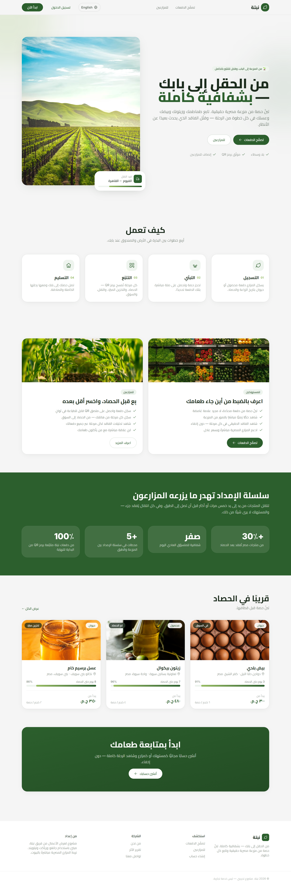
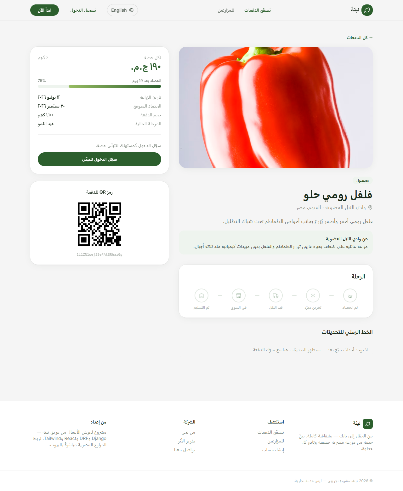
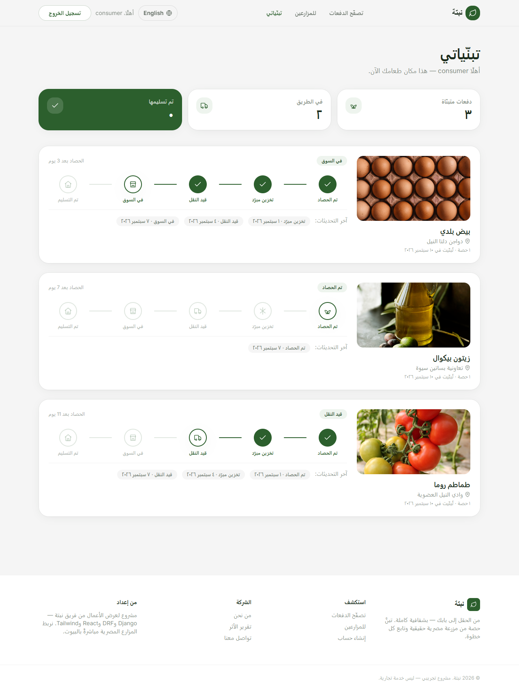

# Nabta 🌱

**From the field to your door — fully transparent.**

🔗 **Live demo: [nabta-sigma.vercel.app](https://nabta-sigma.vercel.app)**
&nbsp; · &nbsp; Demo logins (password `nabtademo123`): **`consumer`** · **`farmer`** · **`admin`**

Nabta connects consumers directly to real farms in Egypt. A consumer *adopts* a
share of a crop or animal batch and follows its journey — harvest, cold storage,
transport, market, delivery — through QR-tracked supply-chain events. A farmer
registers batches, prints a QR label, and logs each stage from their phone. The
same tracking data that helps farmers cut post-harvest loss is what gives the
consumer a transparent, trust-building experience.

> Built for **SmartX Hackathon 2026 — Industry Track**, now maintained as a
> portfolio project. Django REST API + React (Vite) + Tailwind, Arabic-first
> with an English toggle.

---

## The problem

- **30%+** of crops are lost between harvest and market in Egypt — poor storage,
  slow transport, no coordination.
- **Zero real transparency** for consumers about where their food came from.
- Small farmers have **no data** on exactly where loss happens in their chain.

## How it works

1. **Register** — the farmer logs a crop/animal batch and gets a unique QR code.
2. **Adopt** — a consumer claims a share of that batch and follows it.
3. **Track** — every stage (`harvest → cold_storage → transport → market →
   delivered`) is logged against the QR code, recording quantity OK vs. damaged.
4. **Deliver** — the consumer receives their share and sees the full journey,
   including the real loss percentage at each stage.

---

## Screenshots

| Landing | Browse batches | Batch detail |
| --- | --- | --- |
|  |  |  |

| My adoptions (consumer) | Farmer dashboard | Loss analytics |
| --- | --- | --- |
|  |  |  |

**Arabic (RTL)** — the default language; a globe toggle switches to English:

| Landing (عربي) | Batch detail (عربي) | My adoptions (عربي) |
| --- | --- | --- |
|  |  |  |

---

## Stack

| Layer     | Tech                                                              |
| --------- | ---------------------------------------------------------------- |
| Backend   | Django 5.2, Django REST Framework, SimpleJWT, django-filter      |
| Database  | PostgreSQL (SQLite fallback for local dev)                       |
| Frontend  | React 19 (Vite), React Router, Tailwind CSS, Recharts, Axios     |
| i18n      | react-i18next — Arabic default + RTL, English toggle; API serves localized content via `?lang=` |
| QR codes  | `qrcode` (Python) to generate, `BarcodeDetector` to scan         |
| Deploy    | Vercel (frontend) · Render (backend + Postgres)                  |

---

## Local development

### 1. Backend

```bash
cd backend
python -m venv .venv && source .venv/bin/activate     # Windows: .venv\Scripts\activate
pip install -r requirements.txt
cp .env.example .env                                   # optional — SQLite works with no .env
python manage.py migrate
python manage.py seed                                  # 4 farms, 5 batches (EN/AR), demo users
python manage.py runserver                             # http://127.0.0.1:8000
```

**Demo logins** (created by `seed`): `farmer` / `consumer` / `admin` — password `nabtademo123`

### 2. Frontend

```bash
cd frontend
npm install
npm run dev                                            # http://localhost:5173
```

The Vite dev server proxies `/api` and `/media` to `http://127.0.0.1:8000`, so no
CORS setup is needed locally.

---

## API

| Method   | Endpoint                          | Auth       | Purpose                                  |
| -------- | --------------------------------- | ---------- | ---------------------------------------- |
| POST     | `/api/auth/register/`             | –          | Create account (consumer/farmer), returns JWT |
| POST     | `/api/auth/login/`                | –          | Obtain JWT pair + user                   |
| POST     | `/api/auth/refresh/`              | –          | Refresh access token                    |
| GET      | `/api/auth/me/`                   | JWT        | Current user                            |
| GET      | `/api/batches/`                   | –          | List batches (`?search=`, `?category=`, `?mine=1`, `?lang=`) |
| POST     | `/api/batches/`                   | Farmer     | Create batch (auto-generates QR)        |
| GET      | `/api/batches/{id}/`              | –          | Batch detail + tracking timeline + QR image |
| POST     | `/api/batches/{id}/adopt/`        | Consumer   | Adopt a share                           |
| POST     | `/api/batches/{id}/track-event/`  | Farmer     | Log a supply-chain stage                |
| GET      | `/api/my-adoptions/`              | Consumer   | Consumer's adopted batches + status     |
| GET      | `/api/farmer/analytics/`          | Farmer     | Loss % per stage summary                |
| GET/POST | `/api/farms/`                     | – / Farmer | List / create farms                     |

Add `?lang=ar` (or an `Accept-Language: ar` header) to any read endpoint to get
Arabic crop names, farm names, locations and stories.

Run the API tests:

```bash
cd backend && python manage.py test
```

---

## Deployment

### Backend → Render

The repo ships `render.yaml` at the root — in Render, **New → Blueprint** picks it
up, provisions a free Postgres, wires `DATABASE_URL`, and on each deploy runs
`migrate` then `seed` (the seed is skip-if-exists, so it only populates an empty
database). CORS/CSRF already trust every `https://*.vercel.app` origin, so no extra
env vars are needed for the frontend to connect. For Railway, `backend/Procfile`
works the same way with a Postgres plugin.

Static files are served by WhiteNoise (`collectstatic` runs in the build step).

### Frontend → Vercel

- Root directory: `frontend` &nbsp;·&nbsp; `frontend/vercel.json` handles the SPA rewrite.
- Set env var `VITE_API_URL` to `https://<your-backend-host>/api` (for **all**
  environments, so preview deployments work too).

---

## Project layout

```
render.yaml         Render Blueprint (web service + Postgres)
backend/
  config/           Django project (settings, urls, wsgi/asgi)
  accounts/         Custom User with role, JWT auth endpoints
  core/             Farm, Batch, ConsumerSubscription, TrackingEvent
                    serializers, viewsets, role permissions, QR + i18n helpers
                    management/commands/seed.py
frontend/
  src/
    components/      BatchCard, StageStepper, StatCard, LanguageToggle, …
    context/         AuthContext (JWT + refresh)
    i18n/            en.json / ar.json + init (Arabic default, RTL)
    lib/             api.js (axios + interceptors), format.js
    pages/           Landing, ForFarmers, Batches, BatchDetail, Login, Register
      consumer/      MyAdoptions
      farmer/        FarmerDashboard, RegisterBatch, LogEvent, Analytics
```

---

## Data model

- **Farm** — name (+ `name_ar`), owner (User), location (+ `location_ar`), photo, story (+ `story_ar`)
- **Batch** — farm, crop type (+ `crop_type_ar`), category, quantity, price/share,
  planted & expected-harvest dates, unique `qr_code`
- **ConsumerSubscription** — user × batch (unique), quantity committed
- **TrackingEvent** — batch, stage (`harvest → cold_storage → transport → market
  → delivered`), quantity OK / damaged, location (+ `location_ar`), timestamp

---

## Team

- **Farha Mohamed Ghallab** — Full-Stack Python Developer
- **Manar Elsayed Mahmoud** — Full-Stack Python Developer

## License

[MIT](LICENSE) © 2026 Farha Mohamed Ghallab & Manar Elsayed Mahmoud
